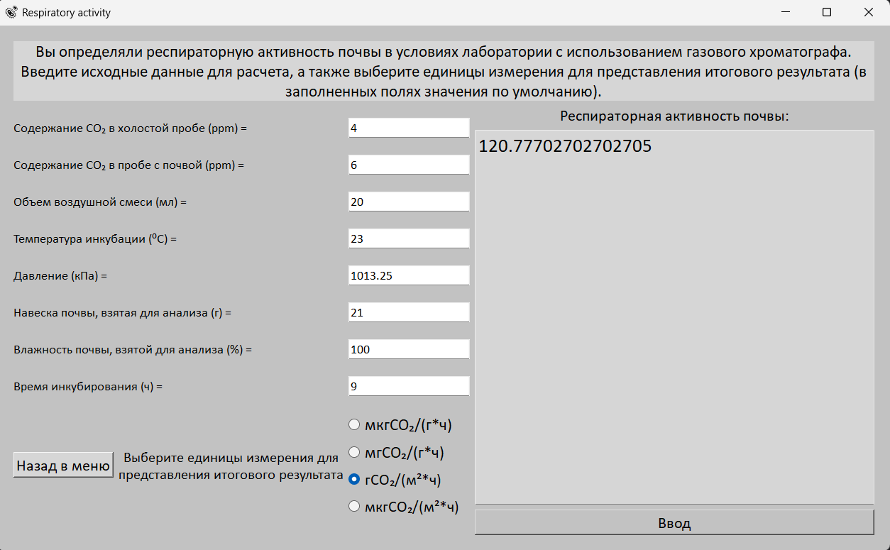
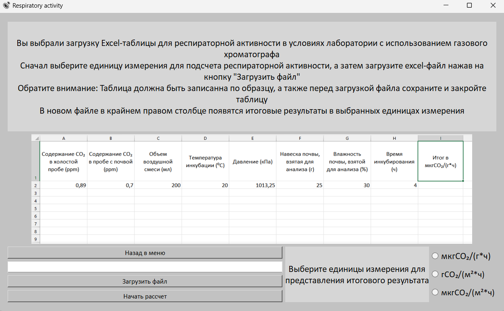
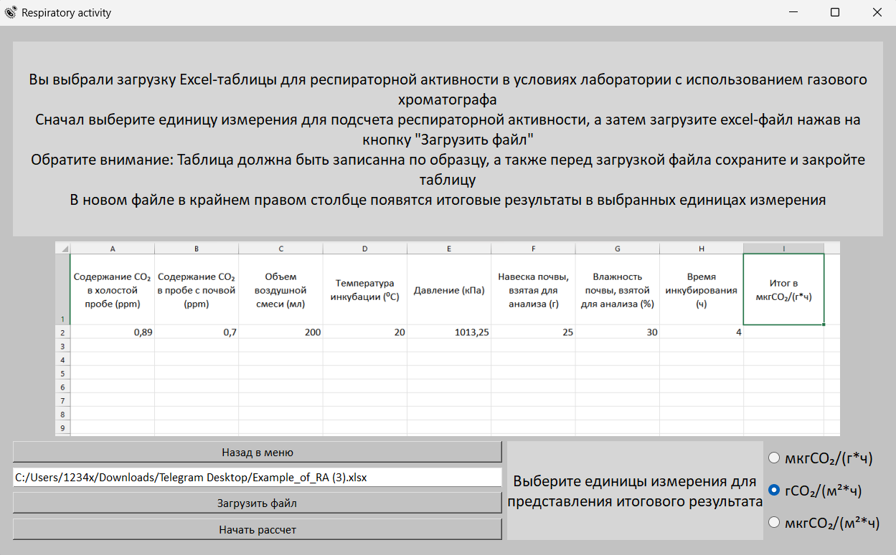

# 🌱 Respiratory Activity

[![PyQt5][PyQt5]][PyQt5-url]
[![OpenPyXL][OpenPyXL]][OpenPyXL-url]
[![Python][Python]][Python-url]

---

### 📘 Introduction

**Respiratory Activity** is a desktop application for calculating the soil’s respiratory activity (SRA). It was developed primarily for laboratory research at **Kazan Federal University**. 🌍

The app supports four different methods of SRA measurement:

- 🧪 In-lab via gas chromatograph  
- ⚗️ In-lab via titration  
- 🌿 In-field via gas chromatograph  
- 🍃 In-field via CO₂ analysis  

Additionally, you can process and calculate SRA directly from **Excel tables** using a dedicated menu. 📊

---

### 🛠 How to Use the Application?

> ⚠️ *Currently, the application is available only in **Russian**, as it was developed for internal use at Kazan Federal University.*

---

### 🏠 Main Menu

From here, you can select a method of SRA calculation or use the **Excel-table** mode by clicking the last button. 🧾

---

### 🧮 Single Case Calculation

The first four buttons lead to screens for each measurement method.  
Each screen contains:

- Input fields (some with default values),
- Radio buttons to select units for output,
- Output display window.

#### 🧭 Workflow:

1. Input values into the respective fields (⚠️ Use a **dot** `.` instead of a comma `,` as the decimal separator).
2. Select the desired output units via radio buttons.
3. Click the calculate button to get your result.

📈 Example output:

---

### 📁 Working with Excel Tables

This section lets you upload an Excel file containing input values. The app will generate a new Excel file with the calculated outputs.

#### 🧭 Workflow:

1. Load the Excel file. The file path will appear above the button.
2. Select output measurement units.
3. Click the **Calculate** button. A new Excel file with results will be saved in the same directory. ✔️

📂 Example result:

---

### ⚙️ Technologies Used

- 🧩 **PyQt5** – for the graphical interface  
- 📄 **OpenPyXL** – for handling Excel files  
- 🏢 Developed for Kazan Federal University

📄 The application has official registration:  
🔗 [State Registration Certificate (№2023669585)](https://new.fips.ru/registers-doc-view/fips_servlet?DB=EVM&rn=6295&DocNumber=2023669585&TypeFile=html)

---

### 📌 Icons and Credits

[PyQt5]: https://img.shields.io/badge/PyQt5-41CD52?style=for-the-badge&logo=qt&logoColor=white
[PyQt5-url]: https://riverbankcomputing.com/software/pyqt/intro

[OpenPyXL]: https://img.shields.io/badge/OpenPyXL-1D6F42?style=for-the-badge&logo=microsoft-excel&logoColor=white
[OpenPyXL-url]: https://openpyxl.readthedocs.io/en/stable/

[Python]: https://img.shields.io/badge/Python-3776AB?style=for-the-badge&logo=python&logoColor=white
[Python-url]: https://www.python.org/

[Windows]: https://img.shields.io/badge/Platform-Windows-0078D6?style=for-the-badge&logo=windows&logoColor=white
[Windows-url]: https://www.microsoft.com/en-us/windows
